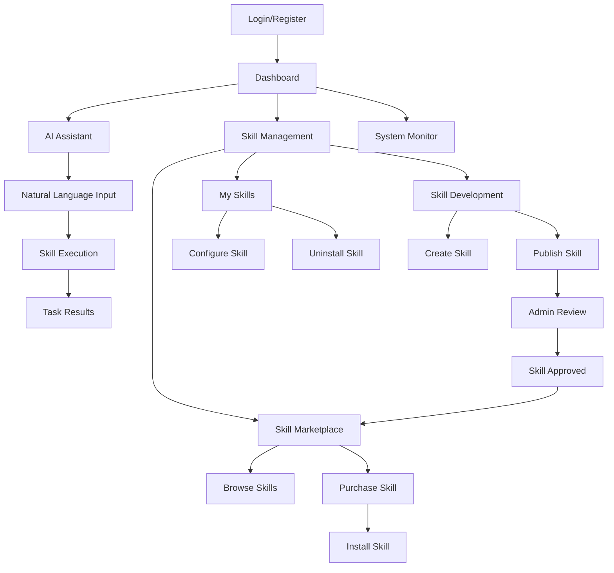

## 1. Product Overview
Co-worker AI (Collig) is an intelligent personal assistant with OS-level permissions that can perform complex tasks and automate workflows. The system features an extensible skill system where developers can contribute new capabilities, and users can buy/sell skills in a marketplace, creating an ecosystem around AI-powered productivity tools.

The product solves the problem of repetitive computer tasks, workflow automation, and provides intelligent assistance for both personal and professional use cases. It targets knowledge workers, developers, and businesses looking to enhance productivity through AI automation.

## 2. Core Features

### 2.1 User Roles
| Role | Registration Method | Core Permissions |
|------|---------------------|------------------|
| Regular User | Email registration | Use basic AI features, browse skill marketplace, purchase skills |
| Skill Developer | Email + developer verification | Create and publish skills, earn from skill sales |
| Premium User | Subscription upgrade | Advanced AI features, priority support, exclusive skills |
| Admin | System assignment | Platform management, skill review, dispute resolution |

### 2.2 Feature Module
Our Co-worker AI requirements consist of the following main pages:
1. **Dashboard**: AI assistant interface, task execution, skill management
2. **Skill Marketplace**: Browse, search, purchase skills, developer profiles
3. **Skill Development**: Create, test, and publish new skills
4. **User Profile**: Account settings, purchased skills, earnings, preferences
5. **Admin Panel**: Skill review, user management, platform analytics

### 2.3 Page Details
| Page Name | Module Name | Feature description |
|-----------|-------------|---------------------|
| Dashboard | AI Chat Interface | Natural language interaction with AI assistant, context awareness, conversation history |
| Dashboard | Task Execution | Run OS-level commands, file operations, application automation, system monitoring |
| Dashboard | Active Skills | Display and manage installed skills, quick access shortcuts, skill configuration |
| Dashboard | System Monitor | Real-time system resource usage, active processes, permission status |
| Skill Marketplace | Skill Browser | Search and filter skills by category, rating, price, compatibility |
| Skill Marketplace | Skill Details | View skill description, reviews, screenshots, system requirements, demo |
| Skill Marketplace | Purchase Flow | Secure payment processing, license generation, automatic installation |
| Skill Marketplace | Developer Profiles | View developer information, other skills, ratings, contact options |
| Skill Development | Skill Builder | Visual workflow editor, code editor, testing environment, documentation tools |
| Skill Development | Publishing | Submit skills for review, set pricing, upload assets, manage versions |
| Skill Development | Analytics | Track skill performance, user feedback, revenue statistics |
| User Profile | Account Settings | Personal information, security settings, notification preferences |
| User Profile | My Skills | Manage purchased skills, update configurations, uninstall options |
| User Profile | Earnings | View revenue from skill sales, withdrawal options, transaction history |
| Admin Panel | Skill Review | Review submitted skills, approve/reject, provide feedback |
| Admin Panel | User Management | Monitor user accounts, handle reports, manage permissions |
| Admin Panel | Platform Analytics | Usage statistics, revenue reports, system health monitoring |

## 3. Core Process

### Regular User Flow
1. User registers and logs into the platform
2. Accesses dashboard to interact with AI assistant
3. Can browse skill marketplace to discover new capabilities
4. Purchases and installs skills to extend AI functionality
5. Uses installed skills through natural language commands
6. Can rate and review purchased skills

### Skill Developer Flow
1. Developer applies for developer status
2. Accesses skill development tools
3. Creates new skills using provided SDK and tools
4. Tests skills in sandbox environment
5. Submits skills for platform review
6. Skills appear in marketplace after approval
7. Earns revenue from skill purchases

### AI Task Execution Flow
1. User provides natural language command
2. AI interprets intent and identifies required skills
3. System checks permissions and security constraints
4. AI executes task using appropriate skills
5. Results are presented to user with execution logs
6. System logs activity for security and improvement

## 4. User Interface Design

### 4.1 Design Style
- **Primary Colors**: Deep blue (#1E40AF) for primary actions, emerald (#10B981) for success states
- **Secondary Colors**: Gray scale for backgrounds and text, orange (#F59E0B) for warnings
- **Button Style**: Rounded corners (8px radius), subtle shadows, hover animations
- **Typography**: Inter font family, 16px base size, clear hierarchy with font weights
- **Layout**: Card-based design with consistent spacing, sidebar navigation for desktop
- **Icons**: Modern line icons from Heroicons, consistent stroke width
- **Animations**: Smooth transitions (200-300ms), subtle loading animations

### 4.2 Page Design Overview
| Page Name | Module Name | UI Elements |
|-----------|-------------|-------------|
| Dashboard | AI Chat Interface | Split-screen layout with chat history on left, active conversation on right. Message bubbles with user/AI distinction, typing indicators, quick action buttons |
| Dashboard | Task Execution | Command palette-style input at top, real-time output console below, progress indicators for long-running tasks |
| Dashboard | Active Skills | Grid layout of skill cards showing icon, name, status toggle, quick actions menu. Filter chips for categories |
| Skill Marketplace | Skill Browser | Search bar with filters sidebar, skill cards in masonry layout showing preview images, ratings, price tags |
| Skill Marketplace | Skill Details | Hero section with skill preview, tabbed interface for description, reviews, requirements. Prominent install/purchase button |
| Skill Development | Skill Builder | Drag-and-drop workflow canvas on left, properties panel on right, top toolbar with test/publish actions |

### 4.3 Responsiveness
Desktop-first design approach with responsive breakpoints:
- Desktop: Full feature set with sidebar navigation (1200px+)
- Tablet: Collapsible sidebar, adjusted grid layouts (768px-1199px)
- Mobile: Bottom navigation, stacked layouts, touch-optimized controls (below 768px)

### 4.4 Security Considerations
- OS-level permissions are explicitly granted by users with clear warnings
- Skills run in sandboxed environments with restricted access
- All skill code is reviewed before marketplace approval
- User activity is logged for security monitoring
- Encrypted communication between frontend and backend
- API keys and sensitive data stored securely in environment variables