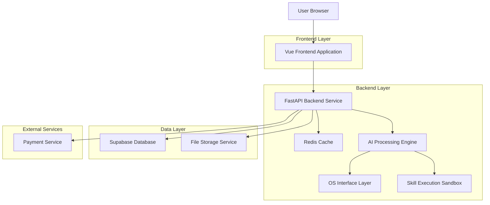
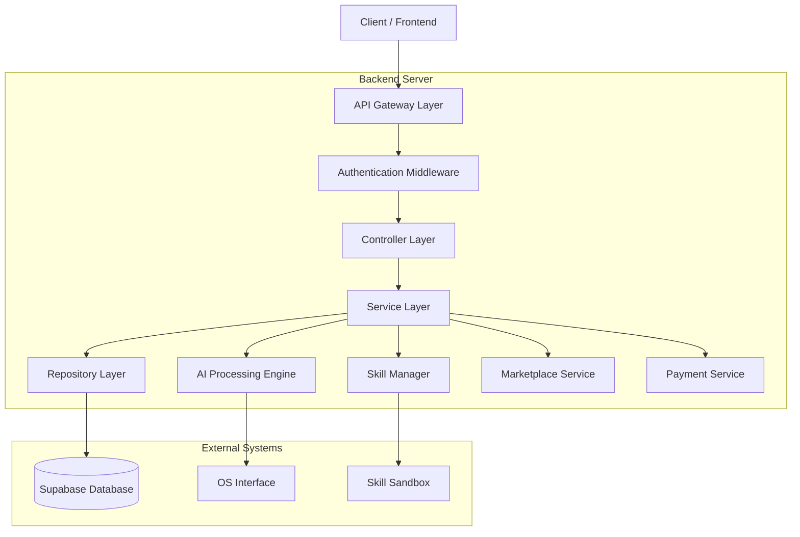
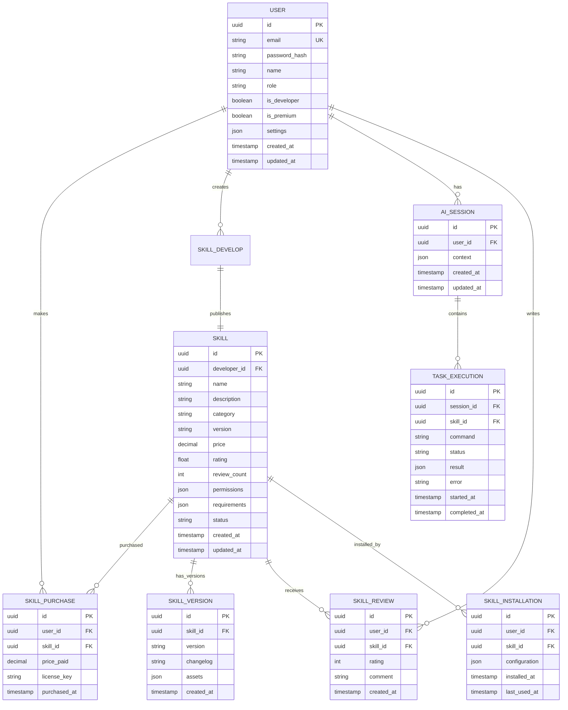

## 1. Architecture design



## 2. Technology Description

* **Frontend**: Vue 3 + tailwindcss + vite

* **Initialization Tool**: npm create vite

* **Backend**: FastAPI (Python) + SQLAlchemy + Redis

* **Database**: Supabase (PostgreSQL)

* **Authentication**: Supabase Auth

* **File Storage**: Supabase Storage

* **Payment Processing**: Stripe API

* **AI Integration**: OpenAI API + LangChain

## 3. Route definitions

| Route                  | Purpose                               |
| ---------------------- | ------------------------------------- |
| /                      | Dashboard with AI assistant interface |
| /auth/login            | User authentication page              |
| /auth/register         | User registration page                |
| /marketplace           | Skill marketplace browse page         |
| /marketplace/skill/:id | Individual skill details page         |
| /skills/my             | User's installed skills management    |
| /skills/develop        | Skill development interface           |
| /skills/publish        | Skill publishing and submission       |
| /profile               | User profile and settings             |
| /profile/earnings      | Developer earnings dashboard          |
| /admin                 | Admin panel for platform management   |
| /admin/skills/review   | Skill review interface for admins     |

## 4. API definitions

### 4.1 Authentication APIs

```
POST /api/auth/login
POST /api/auth/register
POST /api/auth/logout
GET /api/auth/me
POST /api/auth/refresh
```

### 4.2 AI Assistant APIs

```
POST /api/ai/chat
POST /api/ai/execute
GET /api/ai/history
POST /api/ai/clear-history
```

### 4.3 Skill Management APIs

```
GET /api/skills
GET /api/skills/:id
POST /api/skills/install/:id
DELETE /api/skills/uninstall/:id
PUT /api/skills/configure/:id
GET /api/skills/my
POST /api/skills/test
```

### 4.4 Marketplace APIs

```
GET /api/marketplace/skills
GET /api/marketplace/categories
GET /api/marketplace/search
POST /api/marketplace/purchase
GET /api/marketplace/purchases
POST /api/marketplace/review
```

### 4.5 Developer APIs

```
POST /api/developer/skills/create
PUT /api/developer/skills/:id
POST /api/developer/skills/submit
GET /api/developer/analytics
GET /api/developer/earnings
POST /api/developer/withdraw
```

### 4.6 Admin APIs

```
GET /api/admin/skills/pending
POST /api/admin/skills/review/:id
GET /api/admin/users
PUT /api/admin/users/:id
GET /api/admin/analytics
POST /api/admin/platform/settings
```

### 4.7 Core Type Definitions

```typescript
interface User {
  id: string;
  email: string;
  name: string;
  role: 'user' | 'developer' | 'premium' | 'admin';
  created_at: Date;
  updated_at: Date;
}

interface Skill {
  id: string;
  name: string;
  description: string;
  category: string;
  version: string;
  developer_id: string;
  price: number;
  rating: number;
  review_count: number;
  install_count: number;
  requirements: string[];
  permissions: string[];
  created_at: Date;
  updated_at: Date;
}

interface AISession {
  id: string;
  user_id: string;
  messages: Message[];
  active_skills: string[];
  context: Record<string, any>;
  created_at: Date;
  updated_at: Date;
}

interface Message {
  id: string;
  role: 'user' | 'assistant' | 'system';
  content: string;
  metadata?: Record<string, any>;
  timestamp: Date;
}

interface TaskExecution {
  id: string;
  session_id: string;
  skill_id: string;
  command: string;
  status: 'pending' | 'running' | 'completed' | 'failed';
  result?: any;
  error?: string;
  started_at: Date;
  completed_at?: Date;
}
```

## 5. Server architecture diagram



## 6. Data model

### 6.1 Data model definition



### 6.2 Data Definition Language

User Table (users)

```sql
-- create table
CREATE TABLE users (
    id UUID PRIMARY KEY DEFAULT gen_random_uuid(),
    email VARCHAR(255) UNIQUE NOT NULL,
    password_hash VARCHAR(255) NOT NULL,
    name VARCHAR(100) NOT NULL,
    role VARCHAR(20) DEFAULT 'user' CHECK (role IN ('user', 'developer', 'premium', 'admin')),
    is_developer BOOLEAN DEFAULT FALSE,
    is_premium BOOLEAN DEFAULT FALSE,
    settings JSONB DEFAULT '{}',
    created_at TIMESTAMP WITH TIME ZONE DEFAULT NOW(),
    updated_at TIMESTAMP WITH TIME ZONE DEFAULT NOW()
);

-- create index
CREATE INDEX idx_users_email ON users(email);
CREATE INDEX idx_users_role ON users(role);
```

Skills Table (skills)

```sql
-- create table
CREATE TABLE skills (
    id UUID PRIMARY KEY DEFAULT gen_random_uuid(),
    developer_id UUID NOT NULL REFERENCES users(id),
    name VARCHAR(100) NOT NULL,
    description TEXT NOT NULL,
    category VARCHAR(50) NOT NULL,
    version VARCHAR(20) NOT NULL,
    price DECIMAL(10,2) DEFAULT 0.00,
    rating FLOAT DEFAULT 0.0 CHECK (rating >= 0 AND rating <= 5),
    review_count INTEGER DEFAULT 0,
    permissions JSONB DEFAULT '[]',
    requirements JSONB DEFAULT '[]',
    status VARCHAR(20) DEFAULT 'pending' CHECK (status IN ('pending', 'approved', 'rejected', 'suspended')),
    created_at TIMESTAMP WITH TIME ZONE DEFAULT NOW(),
    updated_at TIMESTAMP WITH TIME ZONE DEFAULT NOW()
);

-- create index
CREATE INDEX idx_skills_developer ON skills(developer_id);
CREATE INDEX idx_skills_category ON skills(category);
CREATE INDEX idx_skills_status ON skills(status);
CREATE INDEX idx_skills_rating ON skills(rating DESC);
```

Skill Purchases Table (skill\_purchases)

```sql
-- create table
CREATE TABLE skill_purchases (
    id UUID PRIMARY KEY DEFAULT gen_random_uuid(),
    user_id UUID NOT NULL REFERENCES users(id),
    skill_id UUID NOT NULL REFERENCES skills(id),
    price_paid DECIMAL(10,2) NOT NULL,
    license_key VARCHAR(255) UNIQUE NOT NULL,
    purchased_at TIMESTAMP WITH TIME ZONE DEFAULT NOW(),
    UNIQUE(user_id, skill_id)
);

-- create index
CREATE INDEX idx_purchases_user ON skill_purchases(user_id);
CREATE INDEX idx_purchases_skill ON skill_purchases(skill_id);
CREATE INDEX idx_purchases_license ON skill_purchases(license_key);
```

AI Sessions Table (ai\_sessions)

```sql
-- create table
CREATE TABLE ai_sessions (
    id UUID PRIMARY KEY DEFAULT gen_random_uuid(),
    user_id UUID NOT NULL REFERENCES users(id),
    context JSONB DEFAULT '{}',
    created_at TIMESTAMP WITH TIME ZONE DEFAULT NOW(),
    updated_at TIMESTAMP WITH TIME ZONE DEFAULT NOW()
);

-- create index
CREATE INDEX idx_sessions_user ON ai_sessions(user_id);
CREATE INDEX idx_sessions_updated ON ai_sessions(updated_at DESC);
```

Task Executions Table (task\_executions)

```sql
-- create table
CREATE TABLE task_executions (
    id UUID PRIMARY KEY DEFAULT gen_random_uuid(),
    session_id UUID NOT NULL REFERENCES ai_sessions(id),
    skill_id UUID REFERENCES skills(id),
    command TEXT NOT NULL,
    status VARCHAR(20) DEFAULT 'pending' CHECK (status IN ('pending', 'running', 'completed', 'failed')),
    result JSONB,
    error TEXT,
    started_at TIMESTAMP WITH TIME ZONE DEFAULT NOW(),
    completed_at TIMESTAMP WITH TIME ZONE,
    created_at TIMESTAMP WITH TIME ZONE DEFAULT NOW()
);

-- create index
CREATE INDEX idx_executions_session ON task_executions(session_id);
CREATE INDEX idx_executions_skill ON task_executions(skill_id);
CREATE INDEX idx_executions_status ON task_executions(status);
CREATE INDEX idx_executions_created ON task_executions(created_at DESC);
```

## 7. Security Considerations

### 7.1 Permission Management

* Skills must declare required OS permissions explicitly

* Users must grant permissions before skill installation

* Permission requests show clear warnings about potential risks

* Skills run in sandboxed environments with restricted access

* System-level operations require explicit user confirmation

### 7.2 API Security

* JWT-based authentication with refresh tokens

* Rate limiting on all API endpoints

* Input validation and sanitization

* SQL injection prevention through parameterized queries

* XSS protection through proper output encoding

### 7.3 Data Protection

* Encryption at rest for sensitive data

* Secure transmission via HTTPS

* API keys stored in environment variables

* User passwords hashed with bcrypt

* Session management with secure cookies

### 7.4 Marketplace Security

* All skills undergo security review before approval

* Code scanning for malicious patterns

* Sandboxed testing environment

* User reporting system for suspicious skills

* Quick response system for security incidents

