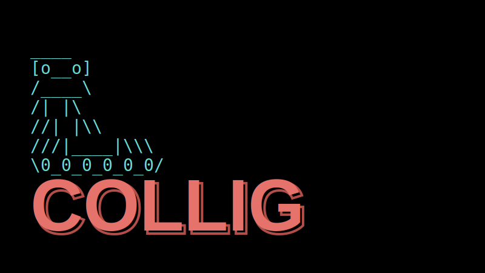

# Collig: Your Intelligent AI Co-worker

Collig is a powerful, locally-running AI agent designed to act as your personal pair programmer and digital assistant. It combines a robust Python backend with a modular skill system, allowing it to interact with your filesystem, browser, email, and more.

## 🚀 Features

-   **🧠 Intelligent Agent:** Powered by LLMs (OpenAI GPT-4o) to understand natural language intent.
-   **🔌 Modular Skill System:**
    -   **Built-in Skills:** Filesystem management, Web browsing, Email (Gmail), Google Maps navigation, Python code execution, System info.
    -   **Extensible:** Supports **Markdown-based Skills** (`SKILL.md`) compatible with the [Open Agent Skills](https://github.com/vercel-labs/skills) standard.
-   **💾 Long-term Memory:** Uses a local vector database (ChromaDB) to remember your notes, preferences, and past conversations.
-   **💻 Interactive CLI:** A rich terminal interface with autocompletion, session management, and history.
-   **🛡️ Secure & Local:** Runs on your machine. Includes `backup` and `restore` commands for easy data migration.

## 🛠️ Tech Stack

-   **Backend:** Python 3.12+, FastAPI, LangChain, ChromaDB
-   **Package Management:** `uv` (Python)

## 📦 Installation

Prerequisites:
-   Python 3.12+
-   `uv` (Python package manager)
-   OpenAI API Key

1.  **Clone the repository:**
    ```bash
    git clone https://github.com/yourusername/collig.git
    cd collig
    ```

2.  **Install dependencies:**
    ```bash
    make install
    ```

## 🏃 Usage

### CLI Assistant (Recommended)
Start the interactive AI co-worker in your terminal:
```bash
make pa
```
*On first run, it will ask for your OpenAI API Key.*

**Commands:**
-   `/exit` or `exit`: Quit the session.
-   `/clear` or `clear`: Clear the screen.
-   `/backup`: Backup your data (config, memory, sessions) to a zip file.
-   `/restore <path>`: Restore data from a backup zip.
-   `/config list`: View current configuration.

### Managing Sessions
List previous chat sessions:
```bash
make list-sessions
```
Resume a session:
```bash
make pa session=<SESSION_ID>
```

## 🧩 Adding Skills

Collig supports the [Open Agent Skills](https://github.com/vercel-labs/skills) format. You can easily add new capabilities by creating a `SKILL.md` file.

1.  Create a directory in `backend/skills/imported/<your-skill>/`.
2.  Add a `SKILL.md` file:
    ```markdown
    ---
    name: My Custom Skill
    description: A description of what this skill does.
    ---
    You are an expert at <topic>. When the user asks about...
    ```
3.  Restart the agent. Collig will automatically load the new skill.

## 🤝 Contributing

Contributions are welcome! Please feel free to submit a Pull Request.

## 📄 License

[MIT](LICENSE)
