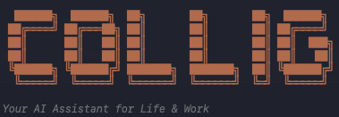

# Collig: Your Intelligent AI Co-worker

Collig is a powerful, locally-running AI agent designed to act as your personal pair programmer and digital assistant. It combines a robust Python backend with a modular skill system, allowing it to interact with your filesystem, browser, email, and more.

## 🚀 Features

-   **🧠 Intelligent Agent:** Powered by LLMs (OpenAI GPT-4o) to understand natural language intent.
-   **⚡ Token-Efficient Tool Usage:**
    - Intelligent tool filtering based on user intent — trivial queries (math, greetings) bypass tools entirely.
    - Intent-matched queries use only relevant tools instead of all 54 tools, reducing token usage by up to 97%.
-   **🔌 Modular Skill System:**
    - **Built-in Skills:** Filesystem management, Web browsing, Email (Gmail), Weather with multi-day forecasts, Git operations, Bookmarks, Notes, Lunar Calendar, News search, and more.
    - **Extensible:** Supports **Markdown-based Skills** (`SKILL.md`) compatible with the [Open Agent Skills](https://github.com/vercel-labs/skills) standard.
-   **🌦️ Weather Forecasts:** Multi-day weather support — ask about tomorrow, next week, or specific days.
-   **💾 Long-term Memory:** Uses a local vector database (ChromaDB) to remember your notes, preferences, and past conversations.
-   **🌐 Web Admin Console:** A full Vue 3 + Vuetify web application with:
    - 💬 **Chat** — Full conversation UI with markdown rendering and token stats
    - 📊 **Dashboard** — Real-time statistics for bookmarks, notes, and chat sessions
    - 🗂️ **Sessions** — Browse, view, and delete all past chat session UUIDs with conversation previews
    - 🔖 **Bookmarks** — Full CRUD table with search, tags, and resizable column widths
    - 📝 **Notes** — Card-based layout with search, edit, and delete
    - 🎨 **Light/Dark Theme** — Toggle with persisted preference
-   **💻 Interactive CLI:** A rich terminal interface with autocompletion, session management, history, and `/console` commands for admin console management.
-   **🛡️ Secure & Local:** Runs on your machine. Includes `backup` and `restore` commands for easy data migration.
-   **🔄 Auto-Reload:** The admin console server automatically restarts when Python files change.

## 🛠️ Tech Stack

-   **Backend:** Python 3.12+, FastAPI, LangChain, LangGraph, ChromaDB
-   **Frontend:** Vue 3, Vite, Vuetify 3, Vue Router, Marked
-   **Package Management:** `uv` (Python), npm (Frontend)

## 📦 Installation

Prerequisites:
-   Python 3.12+
-   `uv` (Python package manager)
-   Node.js / npm (for frontend)
-   OpenAI API Key

1.  **Clone the repository:**
    ```bash
    git clone https://github.com/yourusername/collig.git
    cd collig
    ```

2.  **Install dependencies:**
    ```bash
    make install
    ```

## 🏃 Usage

### CLI Assistant (Recommended)
Start the interactive AI co-worker in your terminal:
```bash
make pa
```
*On first run, it will ask for your OpenAI API Key.*

**Commands:**
-   `/exit` or `exit`: Quit the session.
-   `/clear` or `clear`: Clear the screen.
-   `/backup`: Backup your data (config, memory, sessions) to a zip file.
-   `/restore <path>`: Restore data from a backup zip.
-   `/config`: Interactive configuration manager.
-   `/stats`: View token usage statistics.
-   `/status`: Check system status and LLM connection.
-   `/console status`: Check if the admin console is running.
-   `/console start`: Start the admin console on port 5005.
-   `/console stop`: Stop the admin console.

### Web Admin Console
Start the web application:
```bash
make console-start
```
Then open **http://localhost:5005** in your browser. The console includes:
- Chat interface for conversing with Collig
- Dashboard with real-time statistics
- Session browser to view and manage past conversations
- Bookmark and note management with full CRUD

Stop the console:
```bash
make console-stop
```

### Managing Sessions
List previous chat sessions:
```bash
make list-sessions
```
Resume a session:
```bash
make pa session=<SESSION_ID>
```

## 🧩 Adding Skills

Collig supports the [Open Agent Skills](https://github.com/vercel-labs/skills) format. You can easily add new capabilities by creating a `SKILL.md` file.

1.  Create a directory in `skills/imported/<your-skill>/`.
2.  Add a `SKILL.md` file:
    ```markdown
    ---
    name: My Custom Skill
    description: A description of what this skill does.
    ---
    You are an expert at <topic>. When the user asks about...
    ```
3.  Restart the agent. Collig will automatically load the new skill.

## 🤝 Contributing

Contributions are welcome! Please feel free to submit a Pull Request.

## 📄 License

[MIT](LICENSE)
